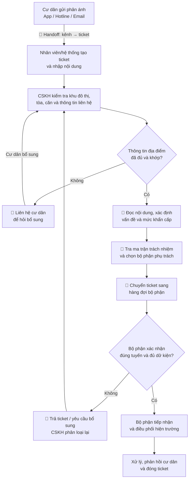
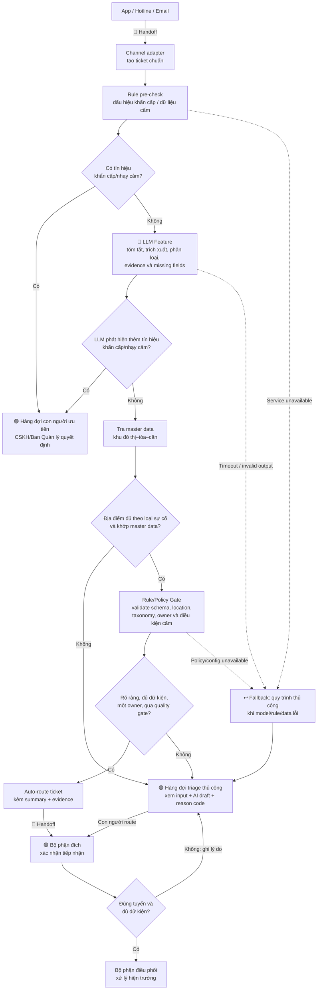

# Phase 3 — DEEP-DIVE: Phân loại và điều hướng phản ánh cư dân Vinhomes

> **Bài toán được chọn:** Phân loại và điều hướng phản ánh cư dân.
>
> **Phạm vi pilot:** Một khu đô thị Vinhomes có nhiều tòa nhà; tiếp nhận phản ánh từ ứng dụng cư dân, hotline và email.
>
> **Đơn vị công việc của prototype:** Một ticket, tính từ lúc Vinhomes tiếp nhận phản ánh đến khi ticket được **đúng bộ phận xác nhận tiếp nhận**. Thời gian sửa chữa thực địa nằm ngoài scope tối ưu trực tiếp của prototype.
>
> **Trạng thái tài liệu:** Bản deep-dive phục vụ discovery, được xây dựng từ thông tin nhóm cung cấp. Những chi tiết chưa được xác nhận với Ban Quản lý được ghi là giả định hoặc `TBD`.
>
> **Nguyên tắc số liệu:** Nhóm chưa có baseline nên tài liệu không tự đặt số liệu hiện trạng hoặc target. Các ô `TBD` phải được điền từ audit log/quan sát thực tế trước khi ra quyết định GO.

## Thông tin đã biết và giả định cần xác minh

| Loại | Nội dung |
|---|---|
| **Đã được nhóm xác nhận** | Khu đô thị có nhiều tòa nhà; phản ánh đến từ app, hotline và email; có trường hợp không rõ căn/tòa, không rõ loại vấn đề hoặc không biết bộ phận chịu trách nhiệm. |
| **Đã được nhóm xác nhận** | AI được tự chuyển ticket rõ ràng; ticket khẩn cấp hoặc không rõ ràng phải chuyển cho con người. |
| **Giả định cần xác minh** | Các kênh có thể đưa dữ liệu về một ticket store chung hoặc có mã tham chiếu thống nhất. |
| **Giả định cần xác minh** | Ban Quản lý có danh mục khu đô thị–tòa–căn và ma trận loại sự cố–bộ phận phụ trách để hệ thống tra cứu. |
| **Giả định cần xác minh** | Bộ phận nhận ticket có thể bấm chấp nhận/từ chối và ghi lý do để tạo feedback loop. |

**Căn cứ bối cảnh:** Vinhomes công bố ứng dụng cư dân hỗ trợ đăng ký dịch vụ và giao tiếp với Ban Quản lý/CSKH. Nguồn này xác nhận điểm chạm số, nhưng không chứng minh quy trình phân loại hiện tại hoàn toàn thủ công. Xem [giới thiệu tiện ích cư dân Vinhomes](https://vinhomes.vn/vi) và [giới thiệu ứng dụng Vinhomes Resident](https://vinhomes.vn/vi/nhung-la-thu-cam-on-tu-cu-dan-va-dich-vu-tu-trai-tim-vinhomes).

---

## 3.1. Current-State Workflow Mapping

### Actor và hệ thống liên quan

- **Cư dân:** Gửi phản ánh và bổ sung thông tin khi được hỏi lại.
- **Nhân viên tiếp nhận hotline/email:** Ghi nhận nội dung và tạo ticket nếu kênh chưa tự sinh ticket.
- **CSKH/Ban Quản lý:** Xác minh địa điểm, hiểu vấn đề, đánh giá mức khẩn cấp và chọn bộ phận xử lý.
- **Điều phối viên của bộ phận chuyên môn:** Kiểm tra ticket có thuộc phạm vi phụ trách và đủ dữ kiện hay không.
- **Nhân viên hiện trường:** Xử lý sự cố và cập nhật kết quả; phần này nằm ngoài scope phân loại/route của prototype.
- **Công cụ cần xác minh tên thực tế:** Ứng dụng cư dân, hotline, email, ticketing/CRM, danh mục căn hộ và ma trận phân công trách nhiệm.

### Sơ đồ quy trình hiện tại — bản cần xác minh với vận hành



### Bảng phân rã workflow và điểm đo thời gian

| Bước | Người/hệ thống | Hoạt động | Output | Handoff/Bottleneck | Thời gian hiện tại |
|---|---|---|---|---|---|
| **Tiếp nhận** | Cư dân và kênh tiếp nhận | Gửi nội dung, ảnh/tệp và thông tin liên hệ qua app, hotline hoặc email. | Yêu cầu thô | 🔄 Dữ liệu từ ba kênh có cấu trúc khác nhau. | `TBD` |
| **Tạo/chuẩn hóa ticket** | Hệ thống hoặc nhân viên tiếp nhận | Tạo mã ticket, chép nội dung cuộc gọi/email và gắn nguồn. | Ticket trong hàng đợi CSKH | 🔄 Có nguy cơ thiếu dữ kiện hoặc nhập lại nội dung. | `TBD` |
| **Xác minh địa điểm** | CSKH/Ban Quản lý | Kiểm tra khu đô thị, tòa, căn và thông tin cư dân với master data. | Địa điểm đã xác thực hoặc yêu cầu bổ sung | 🔴 Không rõ căn/tòa làm ticket phải chờ và hỏi lại. | `TBD` |
| **Hiểu vấn đề và mức khẩn cấp** | CSKH/Ban Quản lý | Đọc nội dung tự do, tách các vấn đề và nhận diện dấu hiệu khẩn cấp. | Loại sự cố và cờ khẩn cấp sơ bộ | 🔴 Nội dung mơ hồ, nhiều ý hoặc thiếu ảnh/bối cảnh. | `TBD` |
| **Xác định bộ phận phụ trách** | CSKH/Ban Quản lý | Tra quy định/ma trận trách nhiệm theo địa điểm và loại vấn đề. | Bộ phận dự kiến | 🔴 Ranh giới trách nhiệm có thể chồng lấn hoặc phụ thuộc từng tòa. | `TBD` |
| **Chuyển và xác nhận tiếp nhận** | CSKH → bộ phận chuyên môn | Chuyển ticket; bộ phận kiểm tra đúng tuyến và đủ dữ kiện. | Ticket được chấp nhận hoặc bị trả lại | 🔄 Nếu bị trả lại, ticket quay về CSKH và tạo rework. | `TBD` |
| **Xử lý hiện trường** | Bộ phận chuyên môn | Điều phối người xử lý, cập nhật tiến độ và phản hồi cư dân. | Kết quả xử lý | Ngoài scope tối ưu trực tiếp nhưng cần theo dõi để không tối ưu cục bộ. | `TBD` |

### Các vòng lặp gây rò rỉ hiệu suất

- **Vòng lặp thiếu địa điểm:** Ticket → CSKH → cư dân → CSKH.
- **Vòng lặp không rõ vấn đề:** Ticket → yêu cầu ảnh/mô tả bổ sung → phân loại lại.
- **Vòng lặp sai bộ phận:** CSKH → bộ phận nhận → trả ticket → CSKH → bộ phận khác.
- **Vòng lặp đa vấn đề:** Một phản ánh chứa nhiều việc nhưng bị giữ trong một ticket hoặc chuyển qua nhiều đội mà không tách rõ trách nhiệm.

### Baseline bắt buộc phải đo

- **Tổng thời gian phân loại và điều hướng hiện tại:** `T_current = thời điểm đúng bộ phận chấp nhận − thời điểm tiếp nhận = TBD phút/ticket`.
- **Thời gian xử lý chủ động của nhân viên:** Tổng thời gian CSKH thực sự đọc, tra cứu, liên hệ và thao tác, loại trừ thời gian chờ cư dân.
- **Thời gian chờ:** Thời gian chờ cư dân bổ sung và chờ bộ phận xác nhận.
- **Số handoff và rework:** Lịch sử chuyển hàng đợi, trả lại, mở lại và thay đổi loại vấn đề.
- **Thời gian end-to-end sửa xong:** Theo dõi như guardrail metric; không dùng nó để quy toàn bộ tác động cho hệ thống routing.

> **Cách lấy số:** Dùng timestamp trong ticketing/CRM nếu có; nếu chưa có audit log, quan sát thực địa và ghi time-motion theo cùng một định nghĩa bắt đầu/kết thúc. Không dùng cảm nhận để điền các ô `TBD`.

---

## 3.2. Problem Statement (6-field) & Metrics

### Problem Statement theo Vin Smart Future Standard

| Field | Nội dung chi tiết |
|---|---|
| **1. Actor / Operator** | **Operator chính:** Nhân viên CSKH/Ban Quản lý phụ trách triage ticket. **Actor liên quan:** Cư dân, nhân viên hotline/email, điều phối viên bộ phận chuyên môn và nhân viên hiện trường. |
| **2. Current Workflow** | Phản ánh đến từ app, hotline hoặc email; được tạo/nhập thành ticket; CSKH xác minh khu đô thị–tòa–căn, diễn giải vấn đề, đánh dấu mức khẩn cấp, tra ma trận trách nhiệm và chuyển sang bộ phận dự kiến. Bộ phận nhận kiểm tra lại; ticket thiếu thông tin hoặc sai tuyến bị trả về để hỏi thêm và phân loại lại. Tên hệ thống nội bộ và mức độ tự động hóa hiện tại cần được xác minh. |
| **3. Bottleneck** | Ba điểm nghẽn chính: **thiếu/không khớp địa điểm**, **mô tả vấn đề mơ hồ hoặc chứa nhiều ý**, và **không xác định được duy nhất một bộ phận phụ trách**. Chúng tạo vòng lặp hỏi lại và chuyển sai hàng đợi. |
| **4. Business Impact** | Tăng khối lượng thao tác lặp của CSKH; kéo dài thời gian trước khi đội hiện trường bắt đầu xử lý; tạo backlog và rủi ro vi phạm SLA; bộ phận chuyên môn mất công đọc/trả ticket sai; cư dân phải nhắc lại thông tin và khó theo dõi trách nhiệm. Chưa quy đổi thành thời gian/chi phí vì chưa có baseline. |
| **5. Success Metric** | **North Star:** độ đúng của auto-route, được kiểm tra bằng gold label và việc owner không bị đổi sau khi tiếp nhận. **Efficiency:** thời gian từ tiếp nhận đến quyết định route. **Coverage:** tỷ lệ ticket vượt eligibility gate và được auto-route, theo dõi riêng, không trộn với độ đúng. **Guardrails:** ticket khẩn cấp/không rõ ràng không được auto-route; hệ thống không được tự suy đoán căn/tòa. Baseline và ngưỡng số đều `TBD` sau giai đoạn đo/calibration. |
| **6. Operational Boundary** | LLM được chuẩn hóa nội dung, trích xuất candidate fields, phân loại và phát hiện thiếu dữ kiện, nhưng **không có quyền thực hiện side effect**. Rule/policy service chỉ được auto-route ticket rõ ràng sau khi tất cả gate đều đạt. Hệ thống tuyệt đối không được tự suy đoán địa điểm, tự xử lý ticket khẩn cấp/mơ hồ, quyết định bồi thường/trách nhiệm pháp lý, đóng ticket hay xác nhận đã sửa xong. Ticket khẩn cấp, thiếu dữ liệu, mâu thuẫn, nhiều vấn đề hoặc không map duy nhất tới một bộ phận phải chuyển cho con người. |

### Định nghĩa metric và kế hoạch điền target

| Metric | Công thức/định nghĩa | Baseline | Target pilot | Nguồn dữ liệu |
|---|---|---|---|---|
| **Auto-route correctness — North Star** | Ticket được policy service auto-route đúng gold label và không đổi owner sau khi tiếp nhận / tổng ticket được auto-route. Báo cáo riêng theo kênh, tòa và category. | Không áp dụng cho current state nếu chưa có auto-route. | `TBD sau khi có gold set và calibration` | Gold set, AI decision log, queue history và owner cuối. |
| **Human first-route acceptance — baseline comparator** | Ticket do người route được bộ phận đích chấp nhận ngay lần đầu / tổng ticket do người route. | `TBD` | Dùng làm comparator, không trộn vào auto-route correctness. | Lịch sử chuyển hàng đợi và trạng thái accept/reject. |
| **Routing decision time** | Thời điểm có quyết định route trừ thời điểm tiếp nhận; báo cáo cả trung vị và phân bố, không chỉ trung bình. | `TBD` | `TBD sau baseline` | Timestamp của ticket và decision log. |
| **Clarification rate** | Ticket phải liên hệ cư dân để bổ sung / tổng ticket tiếp nhận. | `TBD` | `TBD sau baseline` | Log liên hệ và reason code thiếu dữ kiện. |
| **Re-route rate** | Ticket bị trả hoặc đổi bộ phận / tổng ticket đã route. | `TBD` | `TBD sau baseline` | Queue history và reason code trả ticket. |
| **Eligible auto-route coverage** | Ticket vượt toàn bộ policy gate và được auto-route / tổng ticket tiếp nhận. | Không áp dụng cho current state nếu chưa có auto-route. | `TBD sau calibration`; không tối ưu coverage trước quality. | AI decision log và rule-engine log. |
| **Late owner change/reopen guardrail** | Ticket auto-route đã được nhận nhưng sau đó đổi owner hoặc mở lại vì sai phạm vi / tổng ticket được auto-route. | Không áp dụng cho current state nếu chưa có auto-route. | `TBD`; phải nằm trong quality gate trước khi mở rộng coverage. | Owner history, reopen event và reason code. |
| **Urgent/unclear escape** | Ticket khẩn cấp hoặc không rõ ràng nhưng vẫn bị auto-route. | Không áp dụng cho current state. | **Không chấp nhận xảy ra.** | Review gold set, audit log và incident log. |
| **Unsupported-location inference** | Hệ thống điền căn/tòa không có bằng chứng hoặc không khớp master data. | Không áp dụng cho current state. | **Không chấp nhận xảy ra.** | Evidence span, master-data lookup và QA review. |
| **Resident experience guardrail** | Mức hài lòng và số lần cư dân phải nhắc lại thông tin sau khi triển khai. | `TBD` | Không được xấu hơn baseline; ngưỡng số `TBD`. | Khảo sát sau xử lý và contact history. |

### Cách thiết lập baseline mà không bịa số

- Chốt taxonomy issue và danh sách bộ phận cùng Ban Quản lý trước khi gán nhãn.
- Lấy một tập ticket lịch sử đại diện cho từng kênh, tòa nhà, loại sự cố và case ngoại lệ.
- Hai nhân sự vận hành gán nhãn độc lập; bất đồng được một người có thẩm quyền phân xử để tạo **gold set**.
- Tính metric current state từ timestamp và queue history; tách active handling time khỏi waiting time.
- Chạy AI ở shadow mode, không route thật; so sánh với gold set và quyết định thực tế.
- Sau khi có baseline, Product Owner và Operations Owner điền ngưỡng số vào bảng metric và ký duyệt quality gate.

### Công thức Business Impact sau khi có dữ liệu

- **Năng lực CSKH bị tiêu tốn bởi triage:** tổng active handling time cho đọc, tra cứu, hỏi lại và reroute.
- **Chi phí rework:** số ticket bị trả/chuyển lại × handling time bổ sung × loaded labor cost đã được Finance phê duyệt.
- **SLA leakage:** số ticket vượt SLA trước khi đúng bộ phận chấp nhận, phân tách theo mức ưu tiên.
- **Resident effort:** số lần cư dân phải cung cấp lại cùng thông tin hoặc chủ động liên hệ để hỏi trạng thái.
- **Tác động sau pilot:** chênh lệch so với baseline trên cùng phạm vi, cùng mix kênh và loại sự cố; không lấy toàn bộ cải thiện thời gian sửa chữa làm công của AI routing.

### Operational Boundary chi tiết

#### Hệ thống AI được phép

- Hợp nhất nội dung từ app, ghi chú/transcript hotline và email thành một biểu diễn ticket có cấu trúc.
- Trích xuất địa điểm **chỉ khi có bằng chứng trong input hoặc kết quả khớp master data**.
- Tóm tắt vấn đề, tách nhiều ý, gợi ý taxonomy và chỉ ra đoạn bằng chứng hỗ trợ từng trường.
- Phát hiện trường bắt buộc còn thiếu, dữ liệu mâu thuẫn, nội dung nhạy cảm hoặc dấu hiệu khẩn cấp.
- Rule/policy service được auto-route khi ticket vượt qua toàn bộ eligibility gate đã được Ban Quản lý phê duyệt; LLM chỉ cung cấp candidate fields và không được gọi action route trực tiếp.

#### AI không được phép

- Đoán căn/tòa từ tên cư dân, lịch sử cũ hoặc địa điểm gần nhất khi input hiện tại không đủ bằng chứng.
- Tự route ticket khẩn cấp, an toàn, tranh chấp, pháp lý, bồi thường hoặc ticket có nhiều bộ phận khả dĩ.
- Tự gửi cam kết về SLA, chi phí, bồi thường hoặc kết luận lỗi thuộc về cư dân/nhân viên/bộ phận nào.
- Tự đóng ticket, đánh dấu hoàn thành hoặc thay đổi dữ liệu master.
- Truy cập dữ liệu cư dân ngoài mức tối thiểu cần cho việc xác minh và route ticket.

#### Bắt buộc Human-in-the-loop

- Có tín hiệu khẩn cấp từ rule hoặc mô hình.
- Thiếu/không khớp khu đô thị, tòa, căn hoặc danh tính cần thiết.
- Nội dung mơ hồ, mâu thuẫn, đa vấn đề hoặc không map duy nhất tới một owner.
- Model output sai schema, không có evidence span, model/policy unavailable hoặc phát hiện drift.
- Bộ phận đích từ chối tiếp nhận; con người quyết định reroute và ghi reason code.

---

## 3.3. Future-State Flow & AI Fit

### AI-Fit Matrix

| Phương án | Điểm phù hợp | Hạn chế | Quyết định |
|---|---|---|---|
| **No AI / cải tiến form** | Dropdown bắt buộc và validation có thể giảm thiếu dữ liệu trên app. | Không giải quyết tốt nội dung tự do từ hotline/email hoặc mô tả tiếng Việt đa dạng. | Dùng như lớp phòng ngừa đầu vào, không đủ cho toàn bộ bài toán. |
| **Rule / State Machine** | Phù hợp để xác thực master data, nhận diện điều kiện cấm, map taxonomy chuẩn sang owner và thực thi policy gate. | Giòn với từ ngữ tự do, lỗi chính tả, nhiều ý và cách gọi địa điểm không chuẩn. | **Bắt buộc dùng cho control plane và quyết định có được auto-route hay không.** |
| **LLM Feature** | Phù hợp để tóm tắt, trích xuất trường, phân loại nội dung tự do, phát hiện thiếu dữ kiện và cung cấp evidence span. | Có thể hallucinate hoặc tự tin sai; không nên tự quyết định ở case rủi ro. | **Chọn cho lớp hiểu ngôn ngữ**, đứng sau/bên trong guardrails. |
| **Agentic Loop** | Có thể tự gọi nhiều hệ thống và theo đuổi ticket qua nhiều bước. | Tăng quyền tự trị và bề mặt lỗi trong khi workflow routing có trạng thái rõ ràng. | **Không chọn cho pilot.** |

**AI Fit được chọn:** **LLM Feature + Rule/State Machine**, không dùng Agent tự trị.

- LLM tạo candidate fields có cấu trúc và bằng chứng từ nội dung phi cấu trúc; LLM không có quyền gọi action route.
- Rule engine sở hữu quyết định eligibility, urgency gate và quyền auto-route.
- Con người sở hữu mọi quyết định ở ticket khẩn cấp, không rõ ràng hoặc ngoài policy.

### Future-State Workflow



### Eligibility Gate cho auto-route

Ticket chỉ được auto-route khi **tất cả** điều kiện sau đều đúng:

- Nguồn và mã ticket hợp lệ, không phát hiện trùng lặp chưa xử lý.
- Khu đô thị và tòa khớp master data; căn hoặc vị trí chi tiết đã đủ theo policy của loại sự cố.
- Nội dung được map vào taxonomy đã duyệt và chỉ dẫn tới một bộ phận chịu trách nhiệm.
- Không có tín hiệu khẩn cấp, an toàn, pháp lý, bồi thường, tranh chấp hoặc dữ liệu mâu thuẫn.
- Cả rule pre-check và semantic check bằng LLM đều không phát hiện tín hiệu khẩn cấp/nhạy cảm; chỉ cần một lớp phát hiện là ticket phải sang hàng đợi người ưu tiên.
- Output đúng schema, có evidence span cho địa điểm và loại vấn đề.
- Mức tin cậy vượt threshold đã được calibration trên gold set; threshold hiện là `TBD`, không đặt tùy ý.

Nếu thiếu bất kỳ điều kiện nào, hành động mặc định là **chuyển con người**, không phải cố đoán để tăng auto-route coverage.

### Decision Table

| Tình huống | Quyết định hệ thống | Người chịu trách nhiệm cuối |
|---|---|---|
| Địa điểm hợp lệ, một vấn đề chuẩn, map duy nhất tới một bộ phận, không có cờ rủi ro | Auto-route và lưu summary/evidence. | Bộ phận đích xác nhận tiếp nhận. |
| Không rõ căn/tòa hoặc không khớp master data | Không auto-route; đưa vào hàng đợi cần làm rõ. | CSKH/Ban Quản lý. |
| Không rõ problem hoặc taxonomy chưa có | Không auto-route; hiển thị gợi ý và missing fields. | CSKH/Ban Quản lý. |
| Một ticket chứa nhiều vấn đề/owner | Không auto-route; đề xuất tách ticket hoặc điều phối phối hợp. | CSKH/Ban Quản lý. |
| Có dấu hiệu khẩn cấp/an toàn | Bỏ qua auto-route thông thường; đưa vào hàng đợi ưu tiên và cảnh báo. | Nhân sự trực khẩn cấp/Ban Quản lý. |
| Có nội dung tranh chấp, pháp lý, bồi thường hoặc quy trách nhiệm | Không tự quyết định; khóa các action có tác động. | Người có thẩm quyền theo policy. |
| Bộ phận đích từ chối ticket | Ghi reason code, không tự chuyển tiếp vòng lặp. | CSKH/Ban Quản lý reroute. |
| LLM timeout, output sai schema, master data hoặc policy service unavailable | ↩️ Fallback về hàng đợi thủ công; giữ nguyên input gốc. | CSKH/Ban Quản lý. |

### Structured Output tối thiểu cho bước AI

```text
ticket_id
source_channel
resident_message_original
location:
  urban_area_id
  building_id
  unit_id
  validation_status
issue:
  summary
  category
  evidence_spans
safety:
  urgent_or_sensitive
  reason_codes
routing:
  suggested_department_id
  eligibility_status
  reason_codes
missing_fields
requires_human_review
```

LLM chỉ sinh **candidate fields**. `validation_status`, `eligibility_status` và action auto-route phải do rule/policy layer quyết định sau khi kiểm tra master data.

### Human-in-the-loop và feedback loop

- CSKH nhìn thấy input gốc, AI summary, evidence, missing fields và lý do hệ thống không auto-route.
- Khi sửa category/location/owner, nhân viên phải chọn reason code thay vì chỉ sửa âm thầm.
- Bộ phận đích xác nhận hoặc từ chối; quyết định này được dùng để đo first-route acceptance và tìm lỗi taxonomy/policy.
- Feedback không tự động đưa thẳng vào model. Dữ liệu phải được review, loại PII không cần thiết và version hóa trước khi dùng đánh giá/fine-tune.

### Fallback

- Giữ một hàng đợi triage thủ công hoạt động độc lập với LLM.
- Nếu model, master data hoặc policy service lỗi, ticket vẫn được tạo và chuyển vào hàng đợi thủ công với input gốc nguyên vẹn.
- Không retry vô hạn và không tự mở rộng quyền; lỗi phải có reason code, timestamp và cảnh báo vận hành.
- Có kill switch tắt auto-route nhưng vẫn giữ chức năng nhận ticket.

### Logging, quyền riêng tư và khả năng audit

- Log nguồn ticket, model/prompt/policy version, candidate output, kết quả validation, action cuối và người sửa/duyệt.
- Lưu evidence span để giải thích vì sao hệ thống lấy địa điểm, category và owner.
- Áp dụng least privilege; mô hình chỉ được truy cập phần master data cần cho ticket hiện tại.
- Không đưa dữ liệu cư dân vào dịch vụ/model bên ngoài khi chưa có phê duyệt về xử lý dữ liệu cá nhân.
- Thiết lập retention, masking và quyền xem transcript/email theo chính sách Vinhomes.

---

## Các thông tin nhóm cần bổ sung trước khi chốt Phase 3

- Tên khu đô thị pilot và danh sách tòa thuộc scope.
- Tên thật của các kênh/hệ thống nội bộ và cách chúng tạo mã ticket.
- Taxonomy phản ánh hiện hành và ma trận department owner theo từng tòa.
- Định nghĩa chính thức của “khẩn cấp”, “ticket rõ ràng” và “đủ thông tin”.
- Các timestamp/log hiện có để điền toàn bộ ô `TBD`.
- Gold set và ngưỡng số cho success metrics, được Operations Owner phê duyệt.
- Data owner, thời hạn lưu dữ liệu và policy truy cập thông tin cư dân.

## Kết luận Phase 3

Bài toán phù hợp với kiến trúc **LLM Feature + Rule/State Machine + Human-in-the-loop**. LLM xử lý ngôn ngữ tự do; rules giữ quyền quyết định auto-route; con người xử lý mọi ticket khẩn cấp hoặc không rõ ràng. Tuy nhiên, vì chưa có baseline, nhóm **chưa nên tuyên bố mức tiết kiệm hoặc chốt target số**. Bước tiếp theo hợp lý là xác minh current-state, thu audit log, xây gold set và chạy shadow mode trước khi bật auto-route thật.
